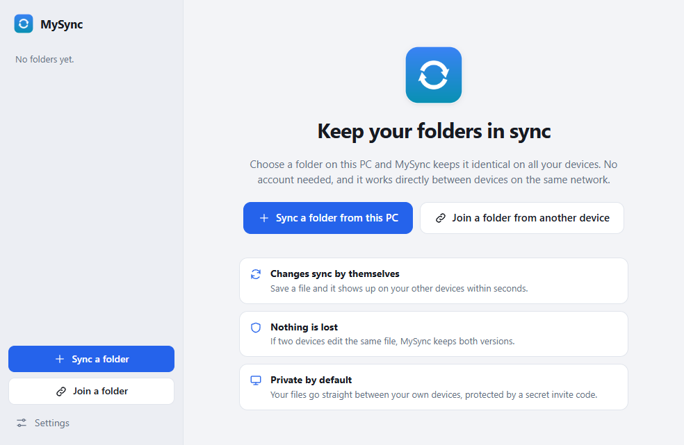
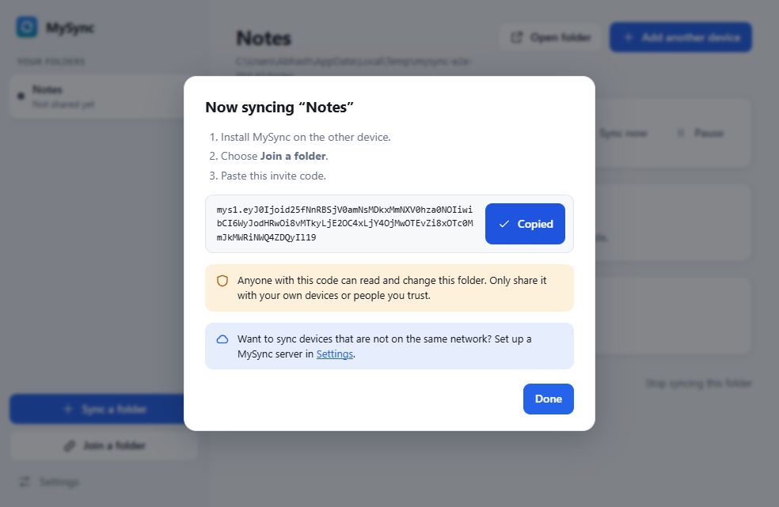

# Using MySync

MySync keeps a folder identical on all your devices. Save a file on one, and a few seconds later it is on the others. There is no account to create and nothing to upload by hand.

## Install

1. Download **MySync-Setup-0.1.0.exe** from the [Releases page](https://github.com/Abhash157/mysync/releases).
2. Run it. It installs just for you, with no administrator password, and opens MySync when it finishes.
3. Windows may show **"Windows protected your PC"**, because this early version is not yet signed with a paid certificate. Choose **More info**, then **Run anyway**.
4. The first time MySync starts, Windows Firewall asks if it may use your network. Tick **Private networks** and allow it. This is what lets your devices find each other at home or at work.

On first start MySync asks what to call this PC (your other devices will see that name) and whether to start with Windows. Both can be changed later in **Settings**.

## Sync your first folder

1. Choose **Sync a folder from this PC** and pick a folder, for example your Documents\Notes.
2. MySync starts watching it straight away and shows an **invite code**.
3. Keep the code handy for the next step. You can get it again at any time with **Add another device**.

MySync adds a folder called `.mysync` inside each synced folder. It holds the history MySync needs, so please leave it alone.

## Put it on another device

1. Install MySync on the other device.
2. Choose **Join a folder**.
3. Paste the invite code. If you copied it just before, MySync fills it in for you.
4. Pick where the folder should be saved and choose **Join folder**.

If that folder already has files in it, they are kept and merged with the synced ones. Nothing is overwritten.

The invite code works as a password: **anyone who has it can read and change that folder**. Share it only with your own devices or people you trust.

## Same network, or far apart

- **Same network (home, office):** nothing to set up. Devices find each other automatically and send files straight to each other.
- **Different places:** devices need a meeting point on the internet. Someone runs a MySync server (`mysync hub serve`, see the main [README](../README.md)), and you enter its address under **Settings → Internet sync**. After that, **Add another device** offers **Put online**, and the invite code works from anywhere.

## What the window tells you

| You see | It means |
| --- | --- |
| **Up to date** | Everything matches your other devices. |
| **Syncing...** | Changes are being exchanged right now. |
| **Not shared with another device yet** | The folder is saved and watched, but no one has joined it. |
| **Cannot reach your other devices** | They are off or on another network. Your changes are kept and will sync when they are back. |
| **Waiting for a file to be closed** | A file is open in another program (such as Word). MySync leaves it alone and syncs it once it is closed. |
| **Paused** | You paused this folder. Nothing is sent or received until you resume. |
| **Needs attention** | Read the message under it. Usually the folder was moved or deleted. |

The icon in the Windows system tray (near the clock) shows the same thing for all folders at once. Closing the window does not stop syncing. To really quit, right-click the tray icon and choose **Quit MySync**.

## If two devices change the same file

You never lose work. MySync keeps both versions: the newest one keeps its name, and the other is saved beside it as, for example, `report.conflict-1a2b3c4.docx`. The window and a Windows notification tell you which file it was, and **Show in folder** opens it. Open both, keep what you want, and delete the other.

## Pause, stop, or remove a folder

- **Pause** (in the folder's status card) stops sending and receiving until you press **Resume**.
- **Stop syncing this folder** removes it from MySync on this PC. Your files stay exactly where they are, and your other devices keep theirs.
- Uninstalling MySync from Windows **Settings → Apps** also leaves every synced folder untouched.

## Troubleshooting

**My devices do not see each other.**
Both must be on the same network (guest Wi-Fi often blocks devices from talking to each other) and have MySync running. Check that Windows Firewall allows MySync on **Private networks** (Windows Security → Firewall → Allow an app). If they still cannot connect, use an internet server, or join with the invite code while both are online.

**"The access code no longer matches."**
The folder was shared again with a new code on the other side. Remove the folder here and join again with the new code.

**A big file is not syncing.**
Files over 100 MB are skipped for now. The window lists them under the folder's status.

**Disk space is filling up.**
MySync keeps a hidden history of your files, so a synced folder uses roughly twice its size. When you add a very large folder, MySync warns you first.

**Something else.**
Open **Settings → About → Open log folder** and look at `mysync.log`; it is plain text and records what went wrong.

## Good to know

- Only folders you choose are synced, and only to devices that have the invite code.
- Files go directly between your devices, or through the server you set up. There is no MySync cloud.
- This is an early version (0.1). Deleted files cannot be restored from inside the app yet, so keep your usual backups.
